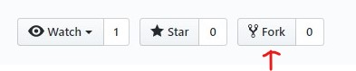

# Intro to JavaScript
Here are the files we will be using during `Intro to JS` meeting on 2/23/2020.
#### If you don't have a text editor/IDE and Git already installed:
1. [Link to install Git](https://git-scm.com/downloads)
2. [Link to install Visual Studio Code](https://code.visualstudio.com/)

#### Follow these steps:
1. Fork this repository by clicking on the `Fork` button at top right corner:

2. After you have forked the repository, clone (your version of the) repos with
`git clone https://github.com/<YOUR_GITHUB_USERNAME>/js-cheat-sheet.git` by opening **git bash**
3. Go into your cloned directory with
`cd js-cheat-sheet`
4. Check out the `starter` branch with
`git checkout starter`